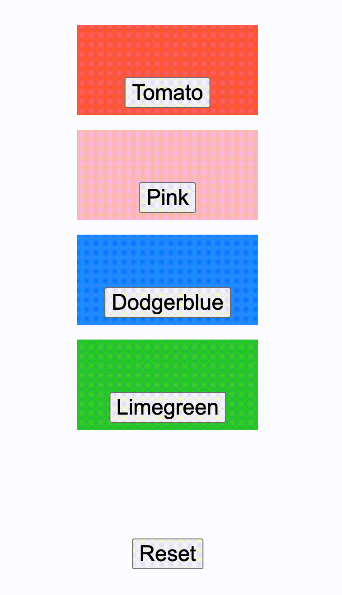

# Vanilla Redux

> 바닐라 리덕스를 이용한 간단한 CRUD를 가진 게시판 만들기

> with [생활코딩](https://opentutorials.org/module/4078)


> [생활코딩](https://opentutorials.org/module/4078/24935)

## flow에서 나오는 리덕스의 용어 정리

store : state가 저징되는 공간

state : (변화되는) 값

getState : stata는 store 외부에서 직접적으로 접근할 수 없다. state 값을 가져오기 위해선 반드시 getState를 이용해서 값을 가져올 수 있다.

render : (변화된) 값을 받아서 UI를 랜더링 하는 메소드. 값이 변할 때마다 랜더링이 이루어져야 한다. 이 때 이용하는 것이 `subscribe` 이다.

subscribe : 등록해 놓으면 값이 변함에 따라서 `render`를 호출하여 새로운 UI를 랜더링 하게 해준다

reducer : dispatch에 의해서 호출될 때, 2개의 값이 전달된다. 첫번째는 현재의 state와 두번째는 action이다. reducer는 전달받은 2개의 값을 토대로 새로운 state를 가공하여 반환한다.

action : 객체로서 dispatch에게 전달된다. action 안에는 `type`이라는 속성이 있다. 이 type이 state가 어떻게 변화할 것인지를 알려주는 flag 역할을 한다.

dispatch : 2가지 역할을 한다. 첫번째는 reducer를 호출하여 action을 전달하여 state의 변화을 유발한다. 두번째는 subscribe를 호출하여 변화된 state에 따라서 render를 유발한다.

## 리덕스가 좋은 이유

-   `중앙 집중적인` state 관리를 통해서 복잡도가 낮아진다
-   state의 변화에 따라서 `시간여행`이 가능하다

> [관련링크](https://medium.com/@wooder2050/%EB%A6%AC%EB%8D%95%EC%8A%A4-redux-%EB%8A%94-%EC%99%9C-%EC%93%B0%EB%8A%94-%EA%B1%B4%EB%8D%B0-2eaafce30f27)

## Exmaple

`Preview`



`구현 내용`

각각의 색을 갖고 있는 4개의 버튼이 있다. 각 버튼을 누르면 버튼이 갖고 있는 색으로 4개의 버튼의 배경색이 변화한다. 리덕스를 사용안하고 구현하면서 이에 대한 복잡도를 간접경험 해본다. 그 후 리덕스를 이용해서 리팩토링함으로서 리덕스가 필요한 이유에 대해서 느껴보자.

`without-redux VS with-redux`


코드를 비교해보자. 가장 큰 차이점은 빨간상자 부분이다.(빨간상자 부분은 이벤트 핸들러부분이다.버튼을 클릭했을 때 어떤 일이 일어나는지에 대한 코드가 들어간다.)리덕스가 없는 경우에는 클릭이벤트가 발생하면 해당 클릭한 부분이 무슨 색인지를 알아낸 후 그 색을 모든 컨테이너에 보내서 색의 변화를 따라서 라랜더링한다.(물론 그 코드 자체는 한 줄로 끝나긴 하지만 로직을 설명하면 저렇다.) 즉 하나의 이벤트 핸들러에서 모든 컨테이너(4개)와 연결되는 로직을 가지고 있어야한다. 이는 결합도가 매우 큰 구조이다.

반면에 리덕스를 사용하는 경우, 무엇을 업데이트 할건지에 대한 내용만을 action 객체로서 dispatch에 전달한다. 즉 클릭하면 어떤 변화가 오는 것인지에 대한 내용만을 핸들러에 표현한다. action을 전달받은 dispatch는 그 action을 reducer를 호출하여 전달한다. reducer는 전달받은 action에 따라서 새로운 state를 생성하고 그 state에 따라서 store에 subscribe된 render 함수에 의해서 컨테이너는 리랜더링된다. 여기서 보면 각각의 단계가 모두 분리되어있다. 그리고 각자의 구성요소들은 각자의 역할만을 하게 된다.

> 참고 위의 이미지에서 reducer부분의 코드가 명확하지 않은 부분이 있어서 수정하였다. 리덕스는 상태값을 직접 수정하지 못한다. 항상 새로운 상태를 생성하여서 업데이트한다. 또한 상태값은 객체로서 주어지는 것이 맞다. 그런데 위의 코드는 그냥 원시타입으로 주어지기 때문에 작동은 하나 개념적으로 명확하지않다.

```javascript
if (action.type === 'change_color') {
    return Object.assign({}, state, { color: action.color });
}
```

> 리듀서에서 반환값은 새로운 상태값이 된다.

## Project
